# CO₂-Router Dokumentation

## Überblick des Projekts

CO₂-Router ist eine Web-Anwendung zur nachhaltigen Routenplanung. Nutzer definieren Start, Ziel und optionale Zwischenstopps und vergleichen verschiedene Verkehrsmittel nach CO₂-Emissionen, Dauer und Komfort. Die Kernfunktionen sind:

- Intuitive Routenplanung mit Start, Ziel und Checkpoints
- Vergleich von Auto, Zug, Flugzeug, Fahrrad, Fähre und ÖPNV
- Konfiguration von Fahrzeugtyp, Antrieb, Personenzahl und Streckentyp
- Visualisierung von Emissionen, Reisezeit und Strecke

## Benutzeroberfläche

Das Design ist übersichtlich strukturiert. Die Startseite zeigt die Reiseplanung und die wichtigsten Filteroptionen.

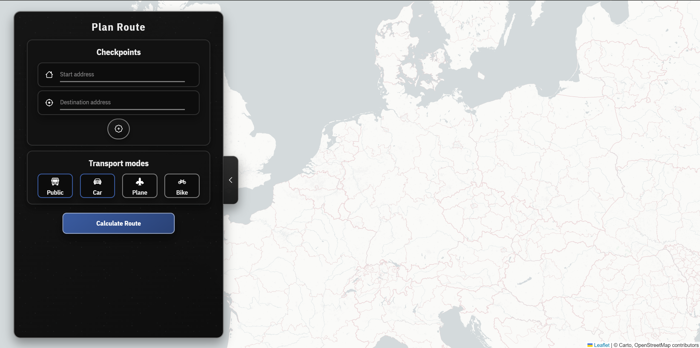

Die Oberfläche kombiniert Eingabefelder mit Kartenansicht und ermöglicht schnelle Vergleiche zwischen verschiedenen Verkehrsmitteln.

Die Checkpoint-Verwaltung und Vorschlagsfunktionen sind direkt in die UI integriert.

| Checkpoint hinzufügen | Vorschlag-Cache |
|---|---|
| 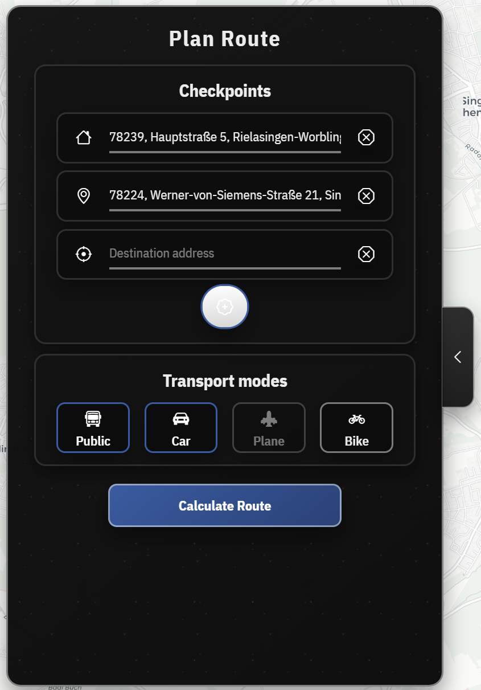 | 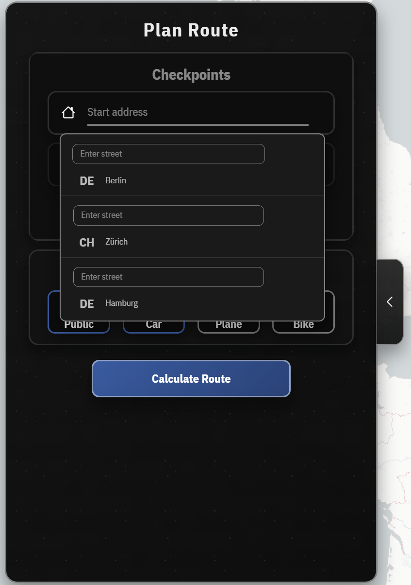 |

Diese Ansicht zeigt, wie Zwischenstopps hinzugefügt und Vorschläge im Hintergrund zwischengespeichert werden, um Eingaben schneller zu machen.

Die Adresssuche liefert intelligente Vorschläge in mehreren Schritten. Höheorientierte Eingabefelder passen gut nebeneinander.

| PLZ-Vorschläge | Straßenvorschläge |
|---|---|
| 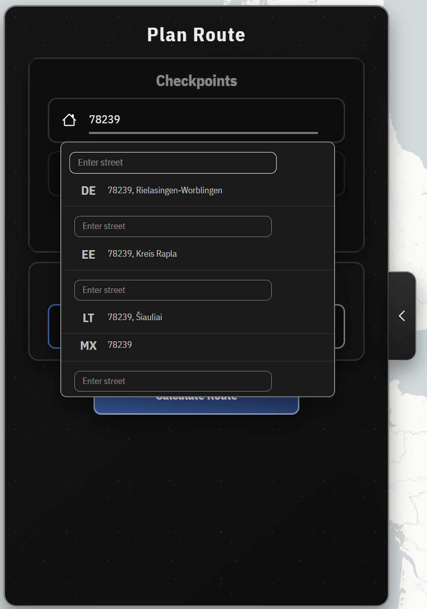 | 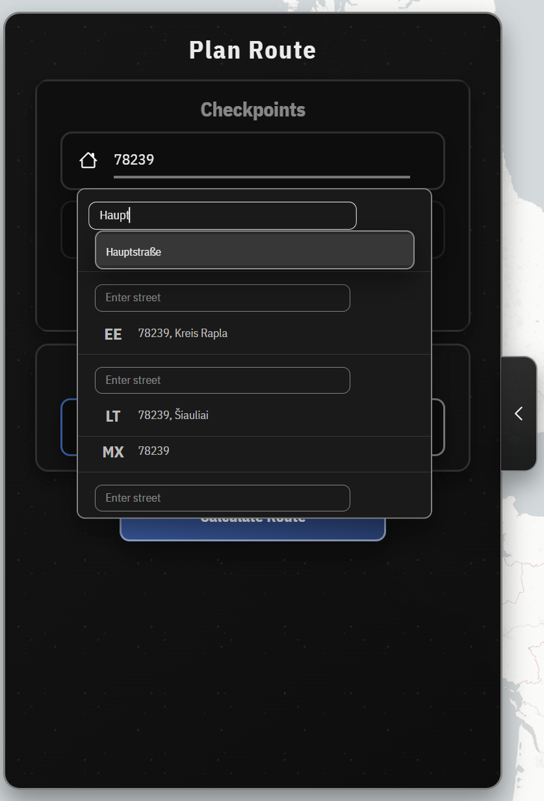 |

Diese Screenshots zeigen die inkrementelle Suche für Postleitzahl und Straße sowie das schnelle Auffüllen relevanter Adressdaten.

| Hausnummer-Vorschläge | Cache-Optimierung |
|---|---|
| 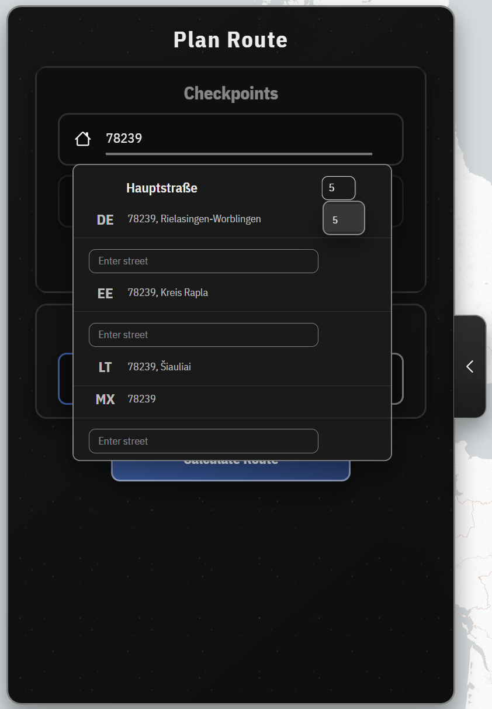 |  |

## Routenplanung und Transportwahl

Die Route Berlin–Zürich zeigt Auswahl und Filterung verschiedener Verkehrsmittel.

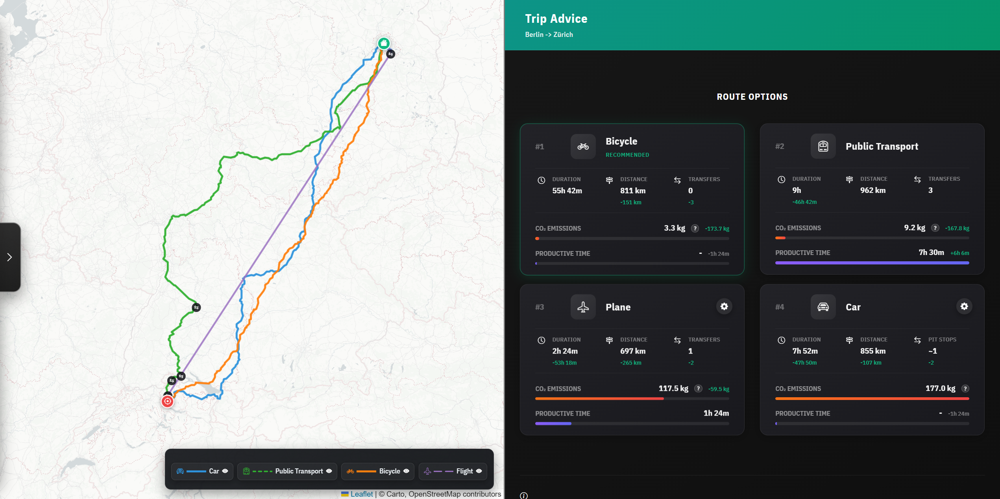

Hier wird die gesamte Reisestrecke visualisiert und die gewählte Route klar auf der Karte dargestellt.

| Gefilterte Gesamtroute | Autofahrten im Detail |
|---|---|
| 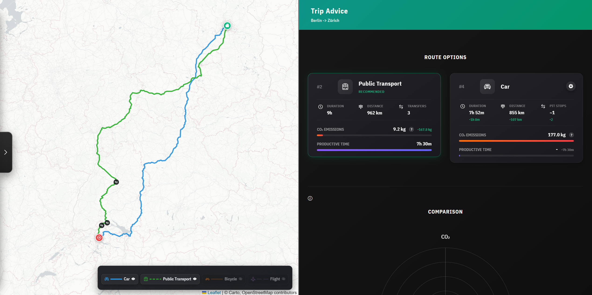 | 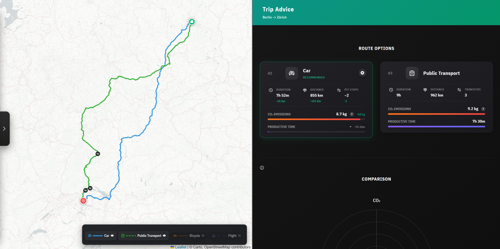 |

Fahrzeugkonfiguration wird kompakt dargestellt, auch Elektrofahrzeuge mit mehreren Passagieren.

| Fahrzeugeinstellungen | Elektrofahrzeug für 6 Personen |
|---|---|
| 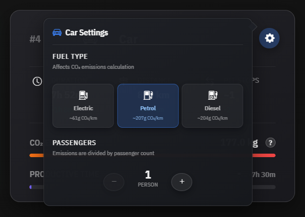 | 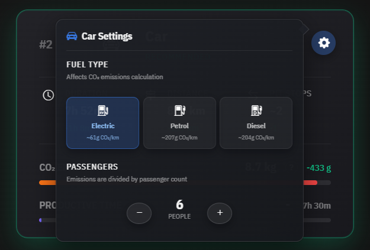 |

Die App zeigt auch Flughafen-Zu-/Abfahrtoptionen und Fähren als Alternativen.

| Flughafen mit Auto | Flughafen mit Bahn |
|---|---|
| 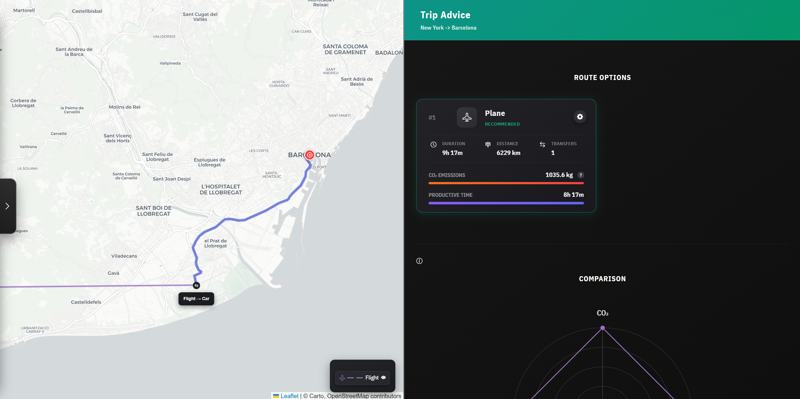 | 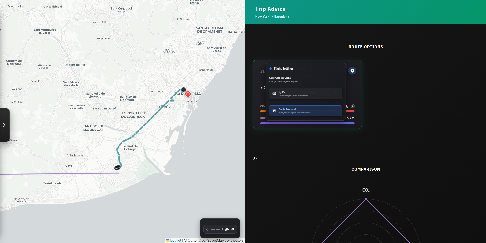 |

Diese Beispiele zeigen unterschiedliche Zugangsmöglichkeiten zum Flughafen, um die Kosten und Emissionen vorab zu vergleichen.

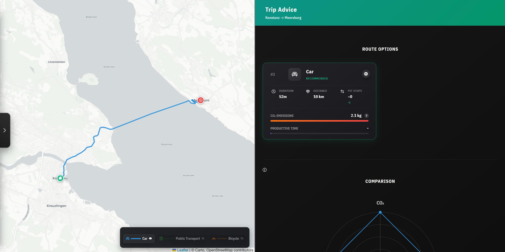

Die Fähre bildet eine umweltfreundliche Option für Strecken, bei denen Wasserwege genutzt werden können.

## Visualisierung

Die Kernanalyse erfolgt über Vergleichsdiagramme, die CO₂-Emissionen, Dauer und Distanz miteinander verbinden.

| Vergleichsdiagramm | Hover-Details |
|---|---|
| 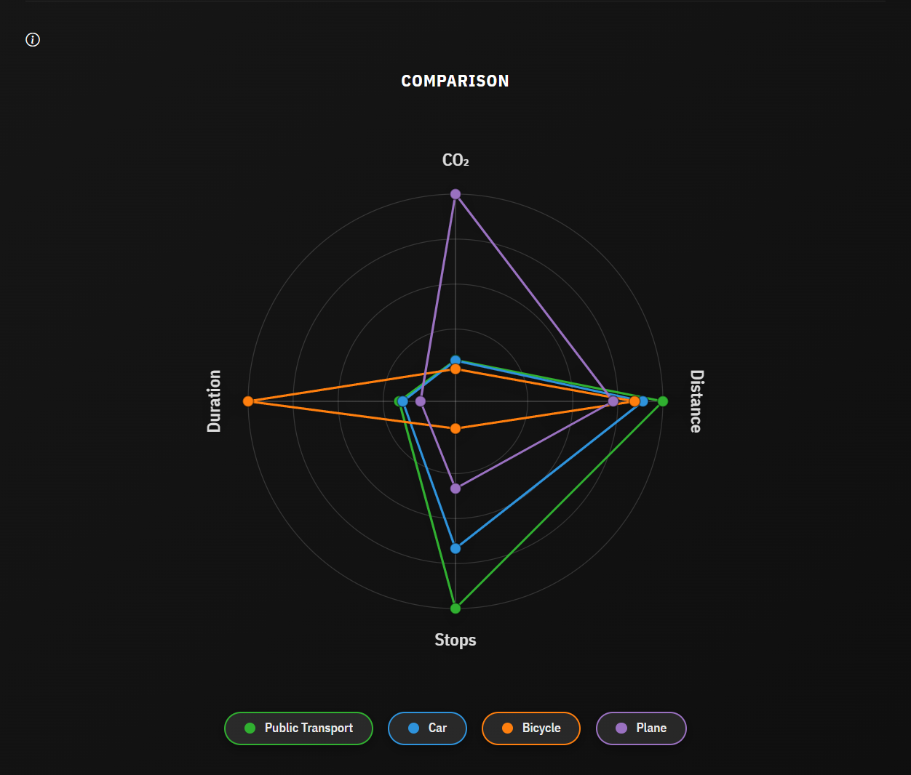 | 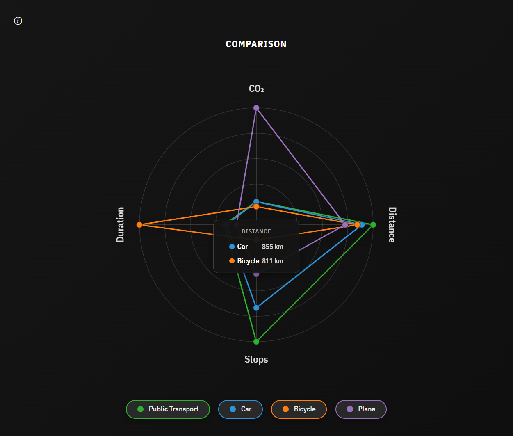 |

Die Analyse basiert auf den Kennzahlen CO₂, Dauer, Distanz und Stopps. Diese Werte ermöglichen den Vergleich von Bahn, Auto, Flugzeug, Fahrrad und Fähre.

## Fazit

CO₂-Router bietet eine klare Übersicht für nachhaltige Mobilitätsentscheidungen. Die Kombination aus Routenplanung, dynamischer Vergleichsansicht und Smart-Search hilft Nutzern, Alternativen zu erkennen und ihre Reise umweltfreundlicher zu gestalten.

### Stärken der Anwendung

- Übersichtliche Benutzerführung
- Klare Emissionsvergleiche
- Flexible Checkpoints und Filter
- Beschreibbare Fahrzeugoptionen

### Potentielle Erweiterungen

- Echtzeit-CO₂-Tracking
- Integration in Buchungssysteme
- Ridesharing-Optionen
- Mehr interaktive Karten
