# PKS Datenanalyse 2014–2024

## Überblick

Diese Dokumentation beschreibt die Analyse der Polizeilichen Kriminalstatistik (PKS) in Deutschland von 2014 bis 2024. Ziel ist es, Trends, regionale Muster und demografische Veränderungen zu erkennen.

- Zeitraum: 2014–2024
- Fokus: Bundesländer, Städte, Altersgruppen, Geschlecht, Nationalität
- Besondere Schwerpunkte: Drogenkriminalität, Gewaltverbrechen, Opferzahlen

## Geografische Analyse

Die Karte zeigt die bundesweite Verteilung der Straftaten und hebt regionale Unterschiede deutlich hervor.

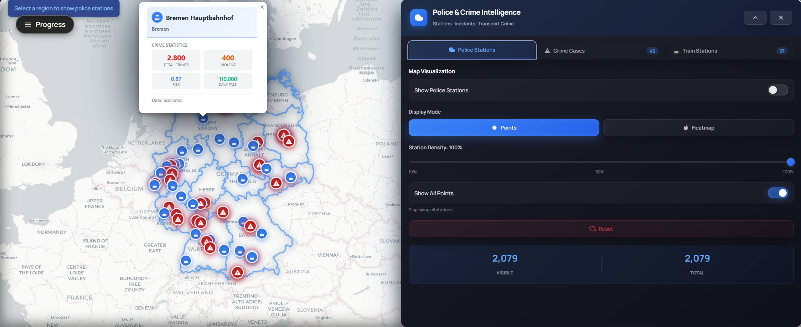

| Bahnhöfe als Hotspots | Ereignisorte im Überblick |
|---|---|
| 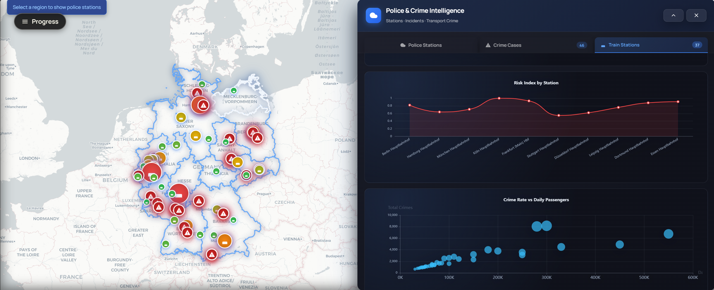 | 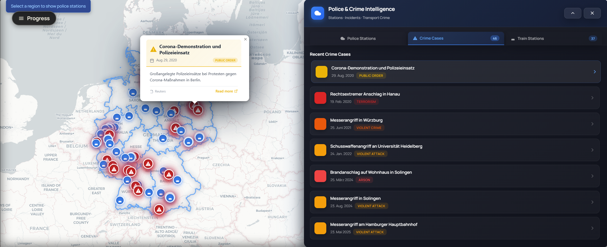 |

## Kriminalitätsentwicklung

Die Gesamtzahlen über den Zeitraum zeigen die Entwicklung der erfassten Straftaten.

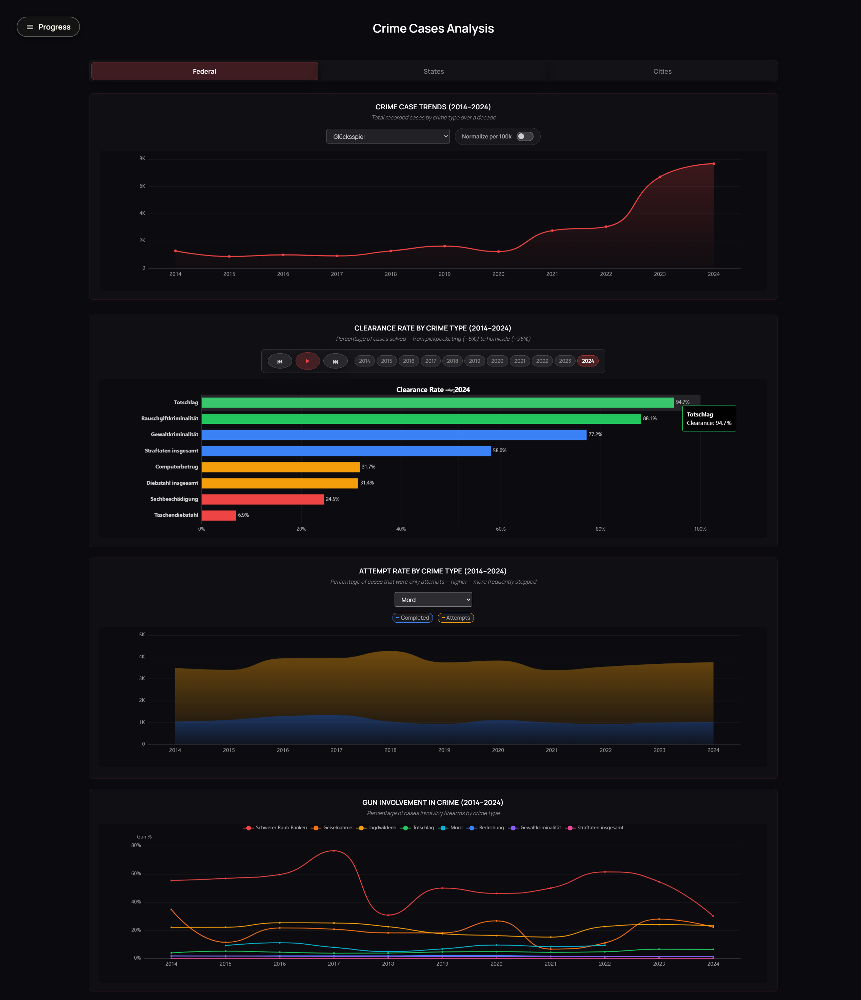

| Bundesländer im Vergleich | Städte im Vergleich |
|---|---|
| 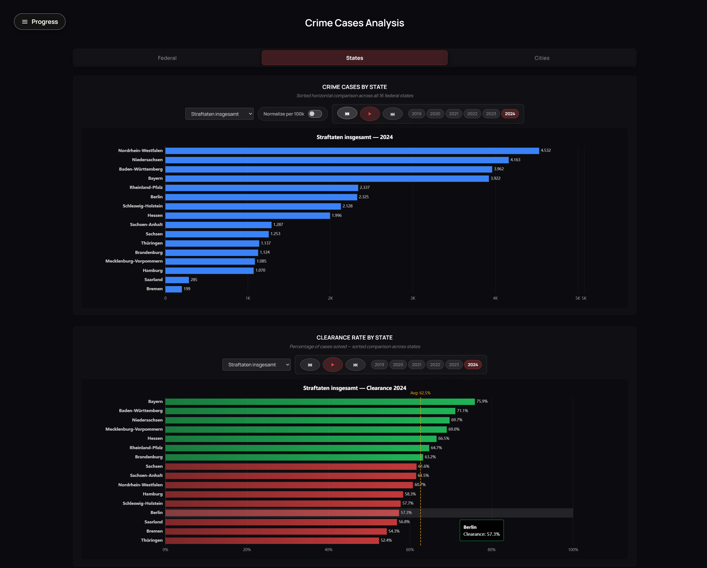 | 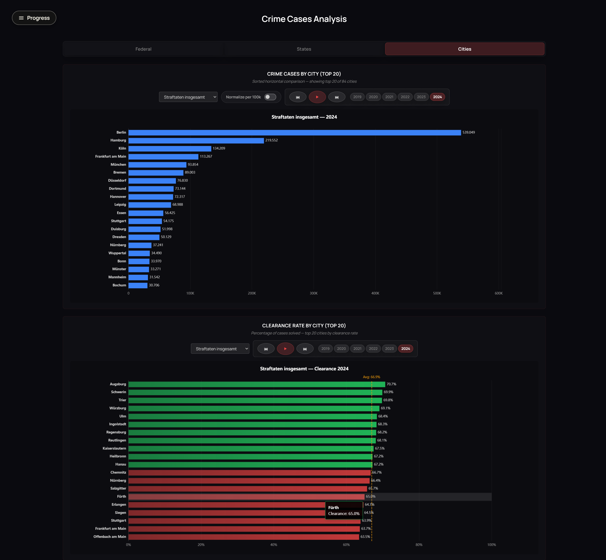 |

## Drogenbezogene Kriminalität

Die Visualisierung zeigt die Verteilung verschiedener Drogenfälle und den Vergleich zwischen Kokain und Crack.

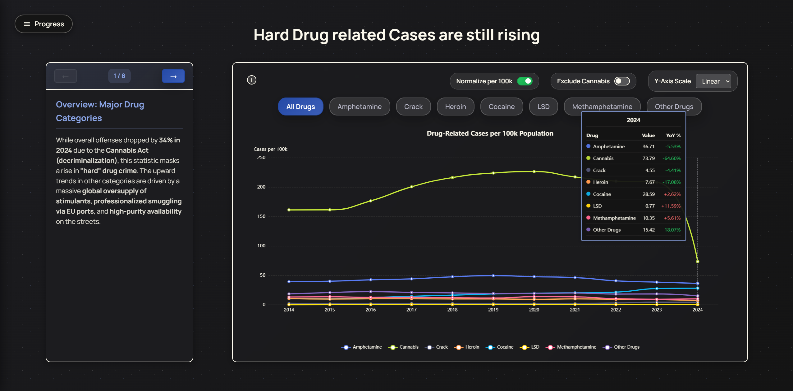

| Kokain vs. Crack | Kokain-Fälle über Zeit |
|---|---|
| 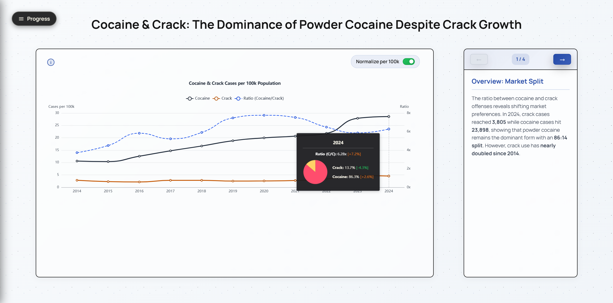 | 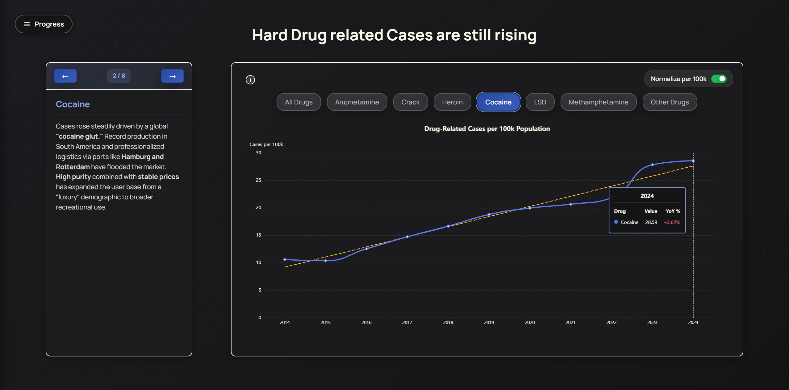 |

### Cannabis-Entwicklung 2024

Die Legalisierung führte zu einem messbaren Rückgang der drogenbezogenen Straftaten.

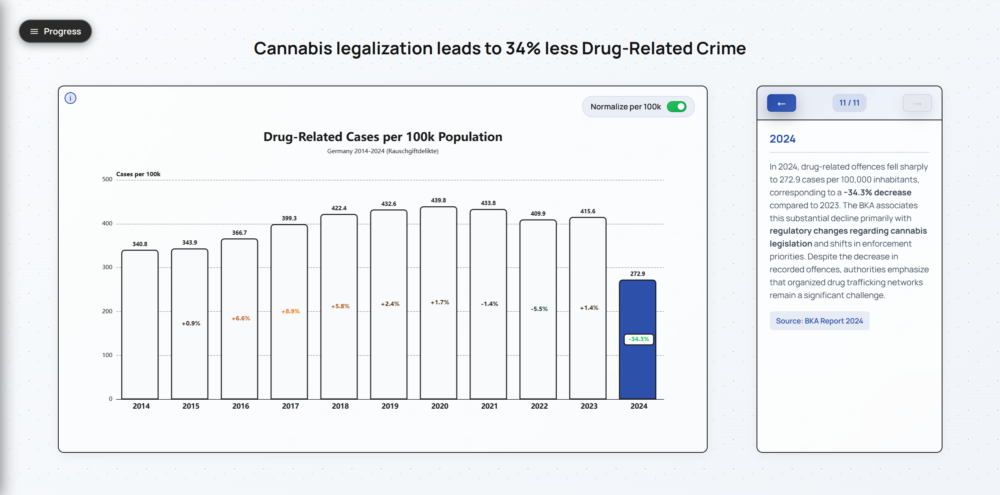

## Gewaltverbrechen

Die Altersgruppenanalyse zeigt einen starken Anstieg bei Kindern und Jugendlichen.

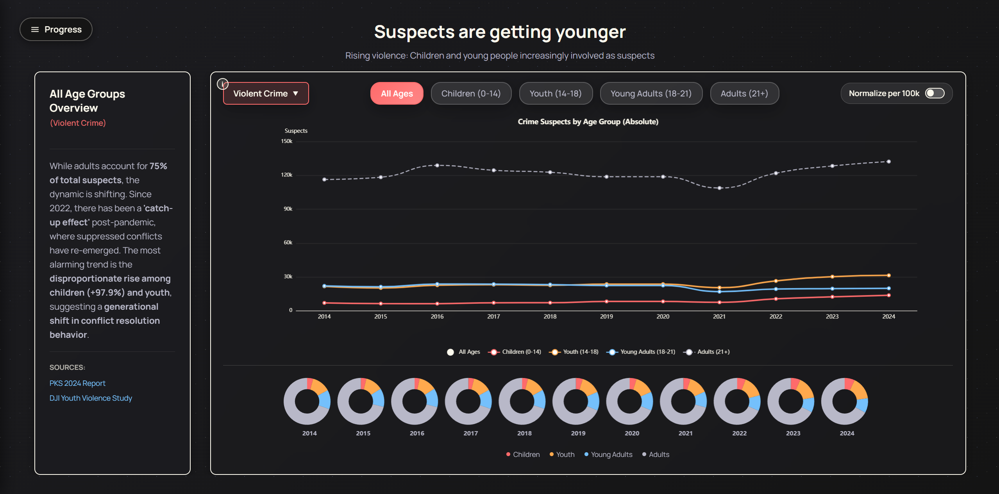

| Normalisierte Gewaltverbrechen | Messerverbrechen |
|---|---|
| 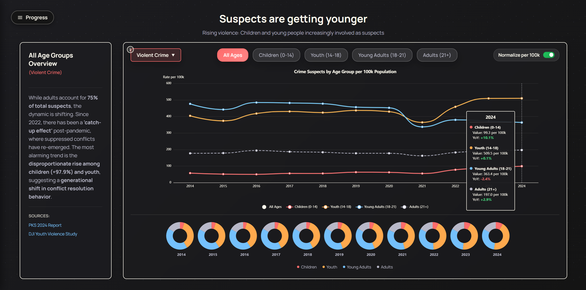 | 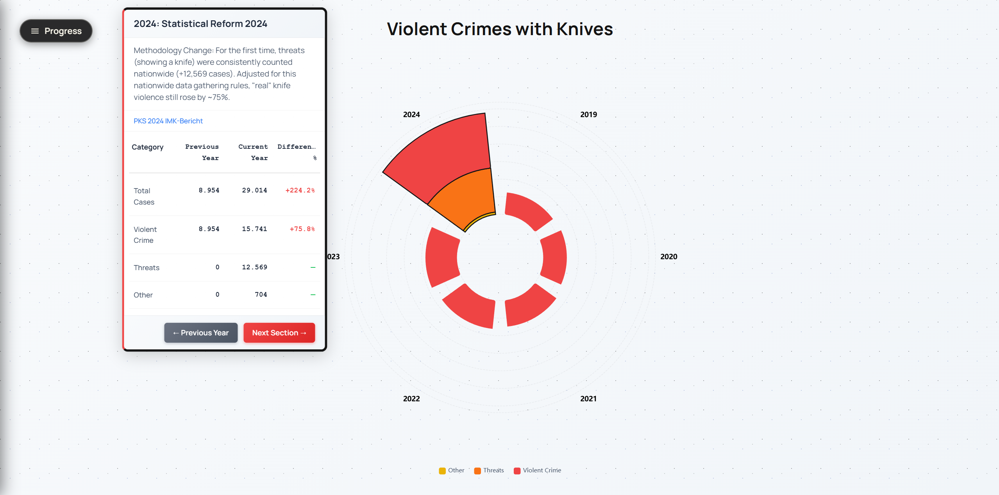 |

### Interaktives Filter-Interface

Die Benutzeroberfläche unterstützt die Analyse verschiedener Gewaltverbrechensarten.

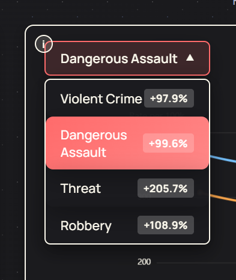

## Geschlechteranalyse

Diese Grafik zeigt die Verteilung männlicher und weiblicher Tatverdächtiger über den Zeitraum.

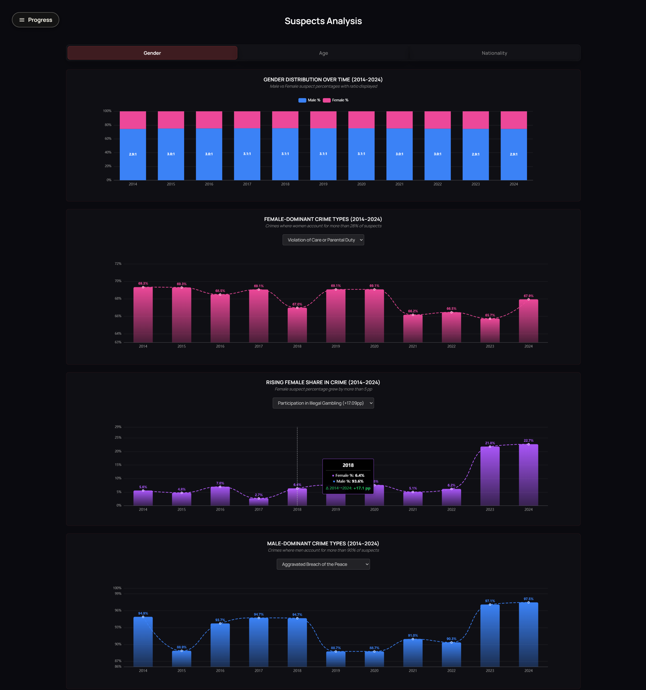

## Demografische Analyse

| Altersgruppen-Dominanz | Nationalität |
|---|---|
| 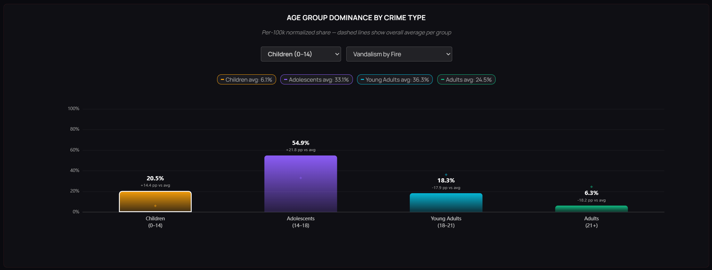 | 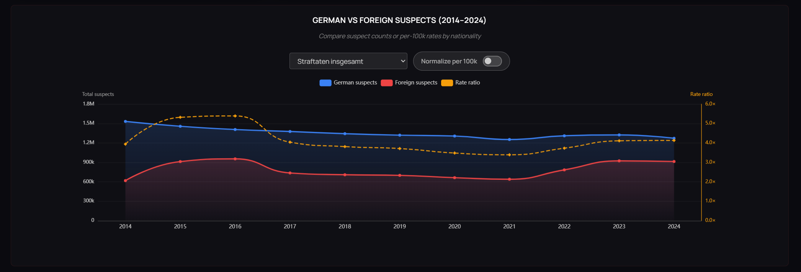 |

| Nationalität normalisiert | Opferentwicklung |
|---|---|
| 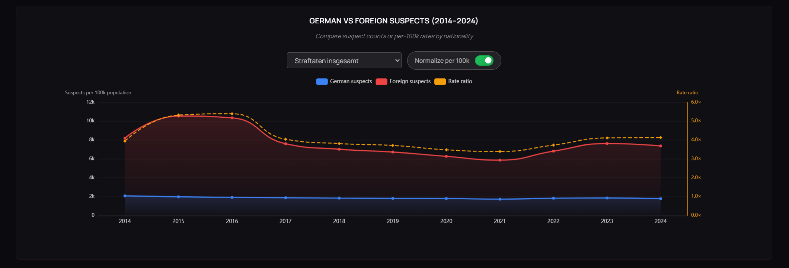 | 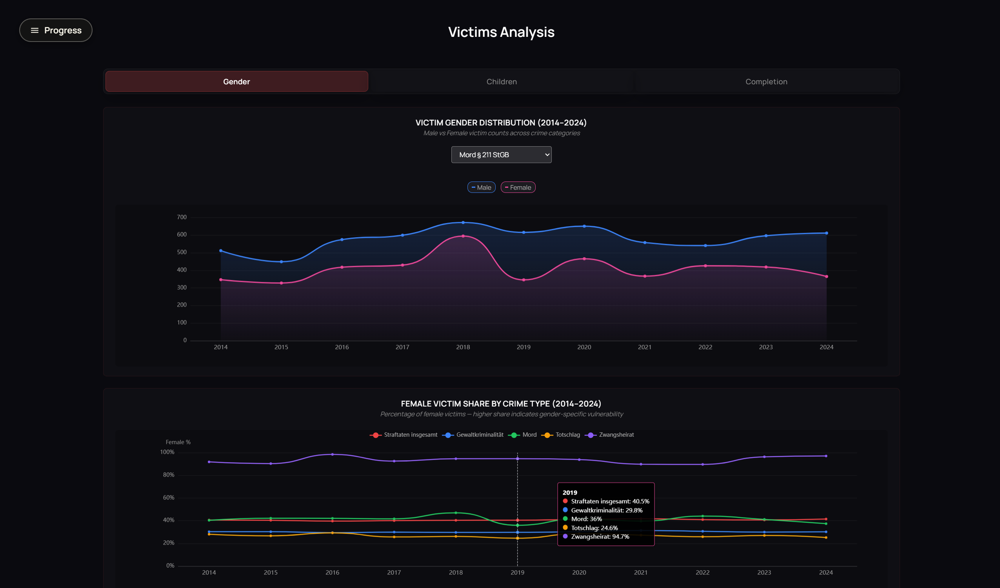 |

## Synthese

Die PKS-Analyse kombiniert geografische, demografische und thematische Auswertungen, um ein umfassendes Bild zu zeichnen.

| Drogenanalyse | Kokain Überblick |
|---|---|
|  |  |

## Schlüsselfunde

- Kinder und Jugendliche sind bei Gewaltverbrechen deutlich stärker vertreten.
- Der Anteil weiblicher Tatverdächtiger steigt, insbesondere bei bestimmten Deliktarten.
- Die Cannabis-Legalisierung 2024 ist mit einem Rückgang der drogenbezogenen Kriminalität verbunden.
- Regionale Unterschiede zwischen Bundesländern und Städten sind stark ausgeprägt.
- Nach 2022 zeigen sich Post-Pandemie-Effekte in mehreren Deliktbereichen.

## Anwendung

Die präsentierten Grafiken eignen sich für Berichte, Präsentationen und politische Diskussionen über Prävention, Jugendkriminalität und Drogenpolitik.
