# 🧩 UseCaseAgent — Projektdokumentation

> **Ein modularer KI-Agent zur nutzerzentrierten Beschreibung von Use Cases** —
> als professionelle Web-App im ChatGPT-/Claude-Code-Stil.

Man beschreibt eine (auch laienhafte) Feature-Idee im Chat; ein **Team
spezialisierter Agenten** stellt Rückfragen, leitet Akteure ab, baut eine
standardisierte Use-Case-Beschreibung und prüft und optimiert deren Qualität —
der **Denkprozess und die Übergaben zwischen den Agenten sind live sichtbar**.
Das Ergebnis wird als saubere `.md`- und `.json`-Datei gespeichert oder zum
Download angeboten.

| | |
|---|---|
| **Stack** | FastAPI (Backend, SSE-Streaming) · Vanilla-JS-Frontend (kein Build) · OpenRouter |
| **Modelle** | Claude Opus 4.8 · GPT-5.6 Sol · GPT-5.6 Terra — je mit vier Denkstufen |
| **Start** | `py run.py` → <http://localhost:8000> |

> 📄 Diese Dokumentation gibt es auch als [PDF](UseCaseAIAgent_Dokumentation.pdf).

---

## Inhalt

1. [Was ist UseCaseAgent?](#was-ist-usecaseagent)
2. [Kernfunktionen](#kernfunktionen)
3. [Der modulare Agenten-Ablauf](#der-modulare-agenten-ablauf)
4. [Technologie-Stack](#technologie-stack)
5. [Rundgang durch die Anwendung](#rundgang-durch-die-anwendung)
6. [Beispiel: ein vollständiger Durchlauf](#beispiel-ein-vollständiger-durchlauf)
7. [Technische Entscheidungen](#technische-entscheidungen)
8. [Installation & Start](#installation--start)
9. [Demo-Video](#demo-video)
10. [English summary](#english-summary)

---

## Was ist UseCaseAgent?

Use Cases sauber zu formulieren ist Handwerk: Man muss die richtigen Akteure
erkennen, Ziele von Abläufen trennen, Vor- und Nachbedingungen sowie
Ausnahmefälle bedenken und das Ganze testbar und eindeutig aufschreiben.
**UseCaseAgent** nimmt einer nicht-technischen Person genau diese Arbeit ab:
Sie beschreibt ihre Idee in Alltagssprache, der Agent führt ein kurzes
Interview und liefert am Ende eine standardisierte Use-Case-Beschreibung im
Cockburn-Stil.

Statt eines einzigen „Black-Box"-Prompts arbeitet im Hintergrund ein **Team aus
fünf spezialisierten Agenten**, die sich die Arbeit sichtbar zuspielen. Jeder
Denkschritt, jede Übergabe und jede erzeugte bzw. bearbeitete Datei wird live im
Chat dargestellt — nachvollziehbar wie bei einem Entwickler-Werkzeug, aber
bedienbar wie ein moderner Chat-Assistent.

---

## Kernfunktionen

- **Echter Chat-Agent mit sichtbarem Denkprozess:** Jeder modulare Schritt
  (Interviewer → Akteur-Analyst → Use-Case-Architekt → Qualitätsmanager →
  Use-Case-Optimierer) ist eine ein-/ausklappbare Zeile. Übergaben zwischen den
  Agenten werden als eigene Ereignisse dargestellt.
- **Dateien im Claude-Code-Stil:** `Erstellt UC-001…json  +105 ›` mit
  Zeilenzähler, Diff-Ansicht (grün/rot) und aufklappbarer Inhalts-Vorschau.
- **Modell- & Denkstufen-Picker:** Auswahl von Modell (Claude Opus 4.8,
  GPT-5.6 Sol/Terra) und Denkstufe (**Niedrig · Mittel · Hoch · Max**) per
  Hover-Flyout.
- **Live-Qualitätsbewertung:** Der Qualitätsmanager vergibt einen Score
  (z. B. *84/100*); der Optimierer behebt die offenen Punkte, danach folgt eine
  Endprüfung — bei Bedarf in mehreren Runden.
- **Spracheingabe** (🎤, Web Speech API, Chrome/Edge), frei wählbarer
  **Ausgabeordner** (sonst Download) und ein **Beispiel-Prompt-Generator** für
  bewusst laienhafte Ideen.
- **Vorschau-Panel:** Der fertige Use Case wird als gerendertes Markdown direkt
  neben dem Chat angezeigt.
- **Chat-Historie**, ein-/ausklappbare Navigation und **Hell/Dunkel-Theme**
  (Akzentfarbe `#009A9B`).
- **Datenschutz:** Der OpenRouter-Key liegt ausschließlich lokal im Browser
  (Einstellungen) und wird pro Anfrage an das lokale Backend gesendet.

---

## Der modulare Agenten-Ablauf

```
Nutzer-Idee
   → Interviewer         versteht die Idee, stellt gezielte Rückfragen
   → (Reife-Prüfung)     genug Infos für einen Use Case?
   → Akteur-Analyst      leitet primäre / sekundäre / System-Akteure + Ziele ab
   → Use-Case-Architekt  baut die standardisierte Beschreibung (Cockburn-Stil)
   → Qualitätsmanager    prüft Vollständigkeit, Eindeutigkeit, Testbarkeit → Score
   → Use-Case-Optimierer behebt die offenen Punkte
   → (Endprüfung)        erneute Kontrolle; ggf. weitere Optimierungsrunde
   → Dateien             finale UC-XXX.md + UC-XXX.json; TMP-Entwürfe gelöscht
```

Jeder Agent streamt seine **Gedanken** (Reasoning) und seine sichtbare Antwort.
Zwischenstände werden als temporäre `.tmp.json`-Entwürfe gespeichert und am Ende
automatisch wieder aufgeräumt — übrig bleiben nur die geprüften Enddateien.

---

## Technologie-Stack

| Schicht | Technologie |
|---|---|
| **Backend** | Python · FastAPI · Uvicorn · Pydantic · httpx |
| **Streaming** | Server-Sent Events (SSE) — Denken, Übergaben und Ergebnisse live |
| **Frontend** | Vanilla HTML/CSS/JS (bewusst ohne Build-Tooling / Node) |
| **Modell-Provider** | OpenRouter (OpenAI-kompatibel) |
| **Spracheingabe** | Web Speech API (Chrome/Edge) |
| **Persistenz** | Chats als JSON; Ausgaben in frei wählbarem Ordner oder Download |

---

## Rundgang durch die Anwendung

### 1 · Startbildschirm

Aufgeräumter Einstieg im ChatGPT-/Claude-Code-Stil: links die Chat-Historie,
zentral die Aufforderung *„Beschreibe eine Idee — ich baue den Use Case."* und
die Prompt-Bar mit Ausgabeordner-Chip, Modell-Picker, Mikrofon und Senden-Knopf.
Der Button **„Beispiel-Prompt generieren"** erzeugt auf Wunsch eine laienhafte
Feature-Idee.

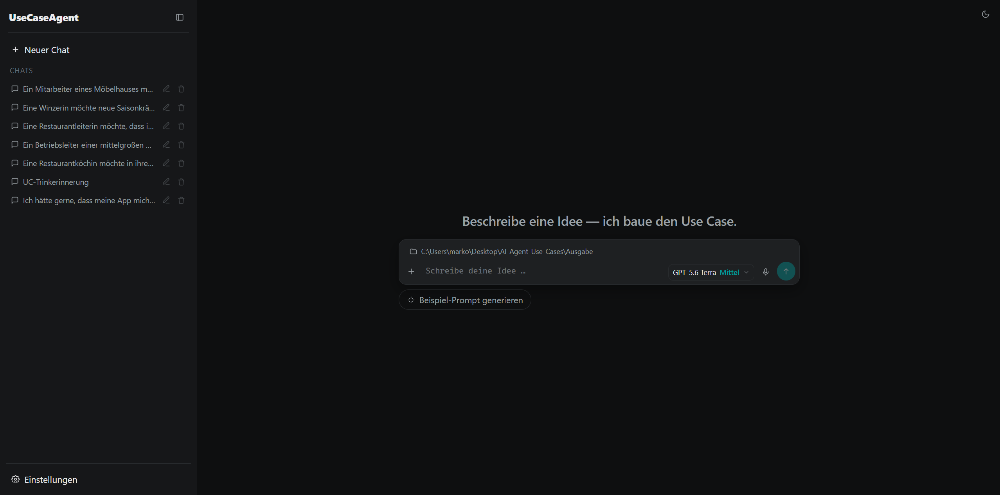

Dieselbe Oberfläche im **hellen Theme**:

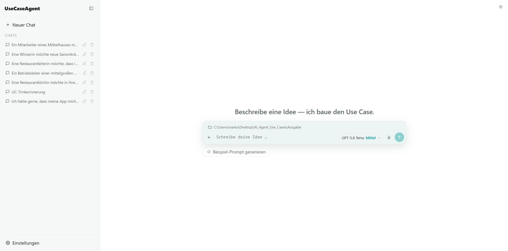

### 2 · Seitenleiste & Navigation

Die ein-/ausklappbare Seitenleiste bündelt **Neuer Chat**, die Liste der
bisherigen Use-Case-Chats (jeweils umbenennbar/löschbar) und den Zugang zu den
**Einstellungen**.

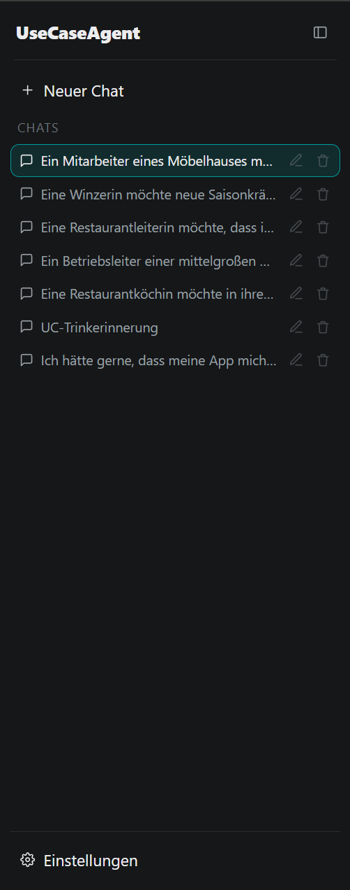

### 3 · Einstellungen: API-Key & Agenten-Vorgaben

Im Einstellungs-Dialog wird der **OpenRouter-API-Key** hinterlegt (nur lokal im
Browser). Darunter lassen sich für **jeden Agenten dauerhafte Zusatz-Vorgaben**
definieren — z. B. eigene Regeln für den Interviewer, den Akteur-Analysten, den
Use-Case-Architekten, den Qualitätsmanager oder den Use-Case-Optimierer.

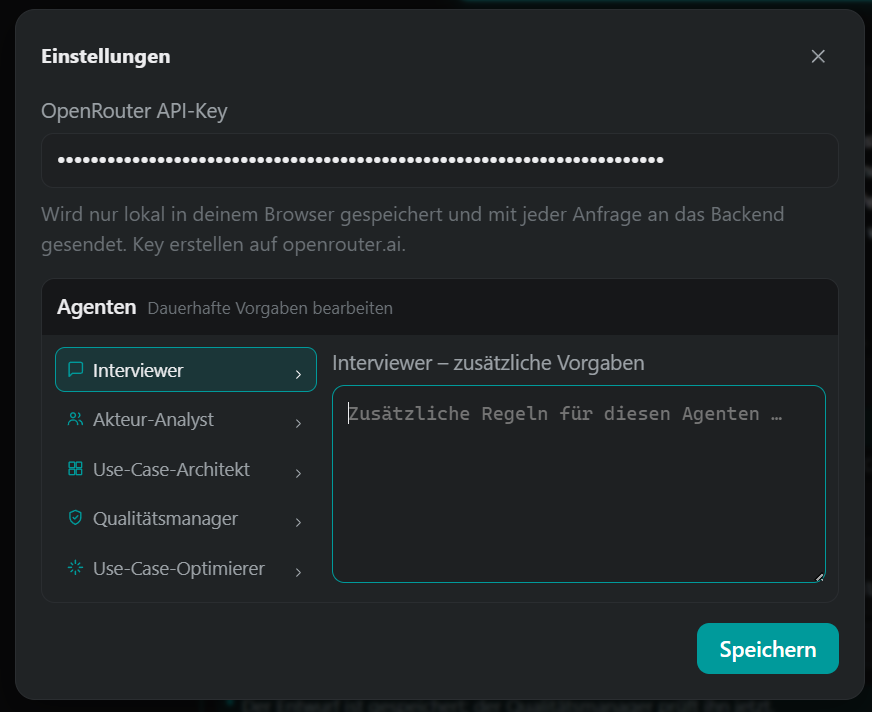

### 4 · Prompt-Bar: Modell, Denkstufe, Sprache & Ausgabeordner

Über den Picker in der Prompt-Bar wählt man Modell und Denkstufe. Ein Hover-Flyout
zeigt die vier Stufen **Niedrig · Mittel · Hoch · Max**. Links sitzt der
Ausgabeordner-Chip, rechts das Mikrofon für die Spracheingabe.

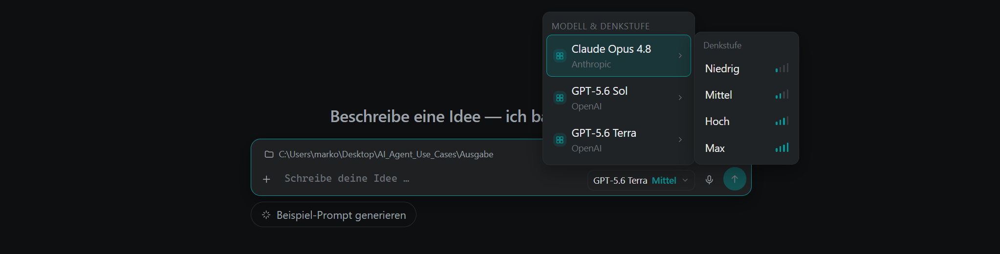

### 5 · Interviewer: gezielte Rückfragen

Der **Interviewer** versteht die Idee und stellt gezielte Rückfragen (hier auf
Wunsch „maximal eine Rückfrage"). Sein **Gedankenstrom** (GEDANKEN) ist
einsehbar, die Rückfragen erscheinen mit den bereits gegebenen Antworten, gefolgt
von einer Zusammenfassung.

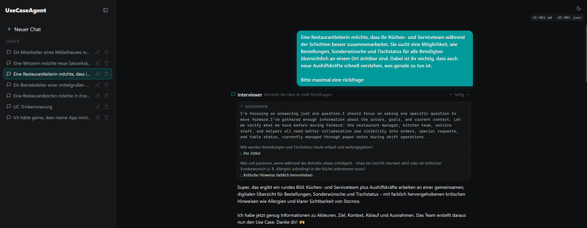

### 6 · Use-Case-Architekt: Entwurf entsteht

Der **Use-Case-Architekt** baut aus den gesammelten Informationen einen ersten
Entwurf. Die erzeugte Datei erscheint im Claude-Code-Stil als
`Erstellt UC-001_draft.tmp.json  +105` mit Zeilenzähler und aufklappbarer
Vorschau des Inhalts (Ziel, primärer Akteur, Stakeholder, Vorbedingungen …).

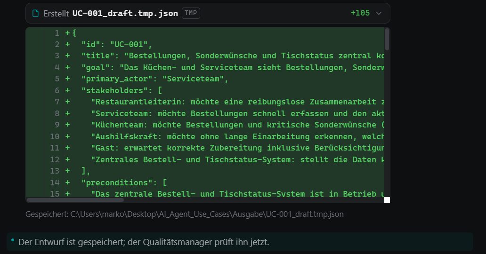

### 7 · Der vollständige Agenten-Ablauf im Chat

Alle Schritte in einer Ansicht: die **Übergaben** (z. B. *Interviewer → Akteur-Analyst*,
*Use-Case-Architekt → Qualitätsmanager*) werden als eigene, farblich abgesetzte
Ereignisse dargestellt. Jeder Agent zeigt Titel, Kurzbeschreibung, Status
(*fertig*) und seinen Gedankenstrom.

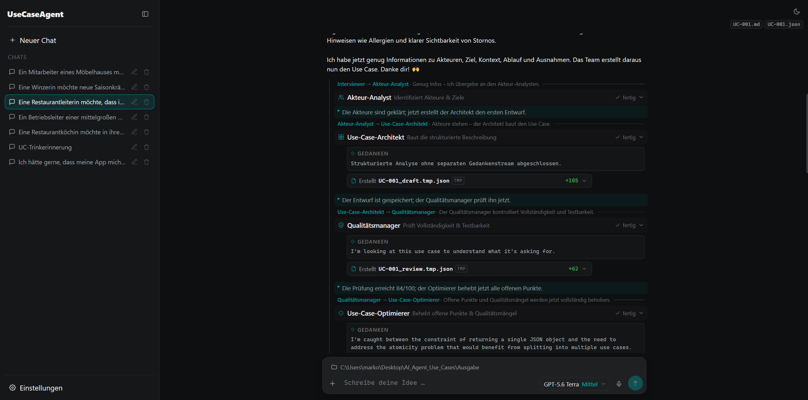

### 8 · Qualitätsprüfung & Optimierung (Diff-Ansicht)

Der **Qualitätsmanager** bewertet Vollständigkeit und Testbarkeit und vergibt
einen Score (hier *84/100*), inklusive strukturierter *issues* (z. B. Kategorie
„Atomarität", Schweregrad „hoch"). Der **Use-Case-Optimierer** behebt die Punkte
und bearbeitet den Entwurf — sichtbar als **grün/rote Diff-Ansicht**
(`+69 −40`).

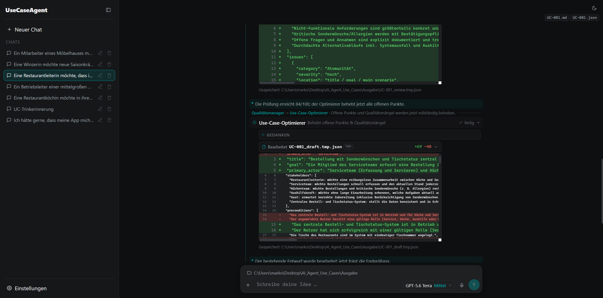

### 9 · Endprüfung, Export & Aufräumen

Nach der Endprüfung wird die geprüfte finale Fassung gespeichert. Die temporären
Entwürfe werden **automatisch gelöscht** (`Gelöscht UC-001_draft.tmp.json  −134`),
und es bleiben die sauberen Enddateien **`UC-001.md`** und **`UC-001.json`**.

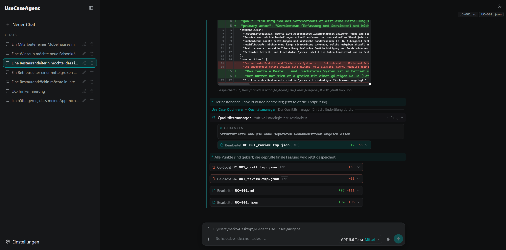

### 10 · Ergebnis: der fertige Use Case

Am Ende meldet der Chat kompakt: *„Der Use Case … wurde erstellt und geprüft."*
mit anklickbarer Ergebnisdatei und der reinen Bearbeitungszeit (hier
*5 Min. 1 Sek.*).

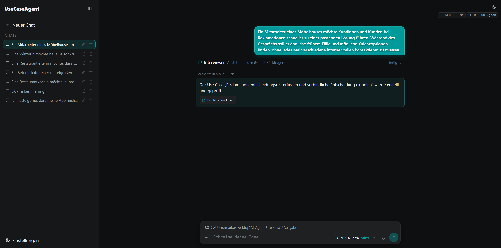

### 11 · Vorschau-Panel

Der fertige Use Case lässt sich direkt neben dem Chat als **gerendertes Markdown**
ansehen — mit Titel, Ziel, primärem Akteur, Auslöser sowie „Stakeholder &
Interessen".

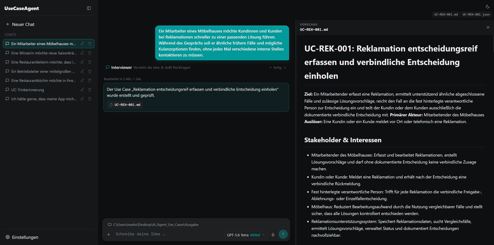

Dieselbe Vorschau im **hellen Theme**:

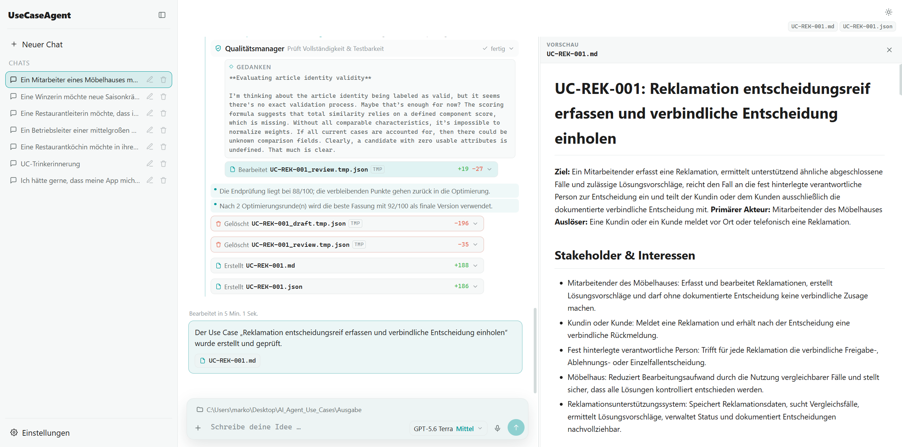

---

## Beispiel: ein vollständiger Durchlauf

Als durchgehendes Beispiel dient die laienhafte Idee eines Möbelhaus-Mitarbeiters:

> *„Ein Mitarbeiter eines Möbelhauses möchte Kundinnen und Kunden bei
> Reklamationen schneller zu einer passenden Lösung führen. Während des Gesprächs
> soll er ähnliche frühere Fälle und mögliche Kulanzoptionen finden, ohne jedes
> Mal verschiedene interne Stellen kontaktieren zu müssen."*

Der Ablauf im Hintergrund:

1. **Interviewer** klärt offene Punkte mit gezielten Rückfragen.
2. **Akteur-Analyst** leitet Akteure und Ziele ab.
3. **Use-Case-Architekt** erstellt den Entwurf `UC-REK-001_draft.tmp.json`.
4. **Qualitätsmanager** prüft und bewertet (Endprüfung *88/100*).
5. **Use-Case-Optimierer** verbessert die offenen Punkte — nach **2
   Optimierungsrunden** wird die beste Fassung mit **92/100** als finale Version
   übernommen.
6. **Export:** `UC-REK-001.md` + `UC-REK-001.json`; die TMP-Entwürfe werden
   gelöscht.

Ergebnis-Titel: **„UC-REK-001: Reklamation entscheidungsreif erfassen und
verbindliche Entscheidung einholen"** — reine Bearbeitungszeit *5 Min. 1 Sek.*

---

## Technische Entscheidungen

- **Streaming (SSE):** Das Backend streamt den gesamten Agenten-Ablauf als
  Ereignisse; das Frontend rendert Denken, Übergaben und Ergebnisse live.
- **Modularität:** Jeder Agent kapselt eine Teilaufgabe mit eigenem Prompt und
  eigener Verantwortung und ist einzeln austausch- und erweiterbar.
- **Zwischenstände als TMP-Dateien:** Entwürfe und Reviews werden transparent als
  `.tmp.json` abgelegt und am Ende automatisch entfernt.
- **Kein Frontend-Build:** Bewusst reines HTML/CSS/JS — läuft ohne Node/Toolchain.
- **Provider-Layer:** Der OpenRouter-Zugriff ist in einer eigenen Client-Schicht
  isoliert; Modelle und Denkstufen sind zentral konfigurierbar.

---

## Installation & Start

```bash
# 1. (optional) virtuelle Umgebung
python -m venv .venv
.venv\Scripts\activate          # Windows   ·   source .venv/bin/activate (macOS/Linux)

# 2. Abhängigkeiten
pip install -r requirements.txt

# 3. Starten
py run.py                        # oder: py -m uvicorn backend.main:app --port 8000
```

Anschließend **<http://localhost:8000>** öffnen und unten links unter
**Einstellungen** einen OpenRouter-Key (`sk-or-…`) hinterlegen.

---

## Demo-Video

Eine vollständige Bildschirmaufnahme des Ablaufs liegt im `images`-Ordner:
[`2026-07-22 15-17-35.mp4`](images/2026-07-22%2015-17-35.mp4).

---

## English summary

**UseCaseAgent** is a modular AI agent for user-centred **use-case** elicitation,
built as a polished, ChatGPT-/Claude-Code-style web app. You describe a (possibly
layman) feature idea in chat; a **team of five specialised agents** — Interviewer,
Actor-Analyst, Use-Case-Architect, Quality-Manager and Use-Case-Optimizer — asks
clarifying questions, derives actors, produces a standardised use-case
description, scores its quality and optimises it, with the **agents' reasoning and
hand-offs shown live**. Intermediate drafts are kept as temporary files and
cleaned up automatically; the final `.md` + `.json` are saved to a folder or
offered as downloads.

**Stack:** FastAPI backend (streams the agent run via SSE), vanilla-JS frontend
(no build step), OpenRouter as the model provider. Features: collapsible agent
steps, Claude-Code-style file rows with diffs and line counts, a model picker with
thinking levels, voice input, output-directory selection, an example-prompt
generator, a rendered use-case preview, chat history and a dark/light theme.

**Run:** `py run.py`, open <http://localhost:8000>, then add an OpenRouter API key
under *Einstellungen* (Settings).
